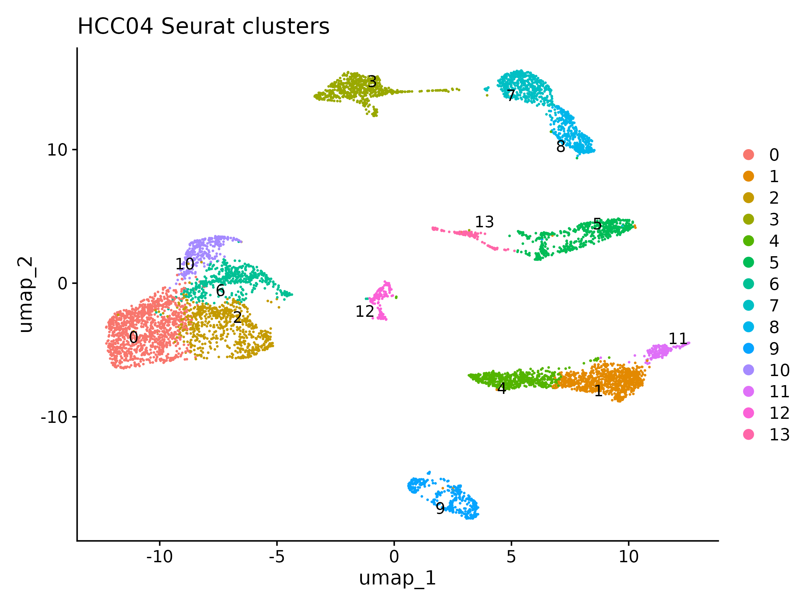
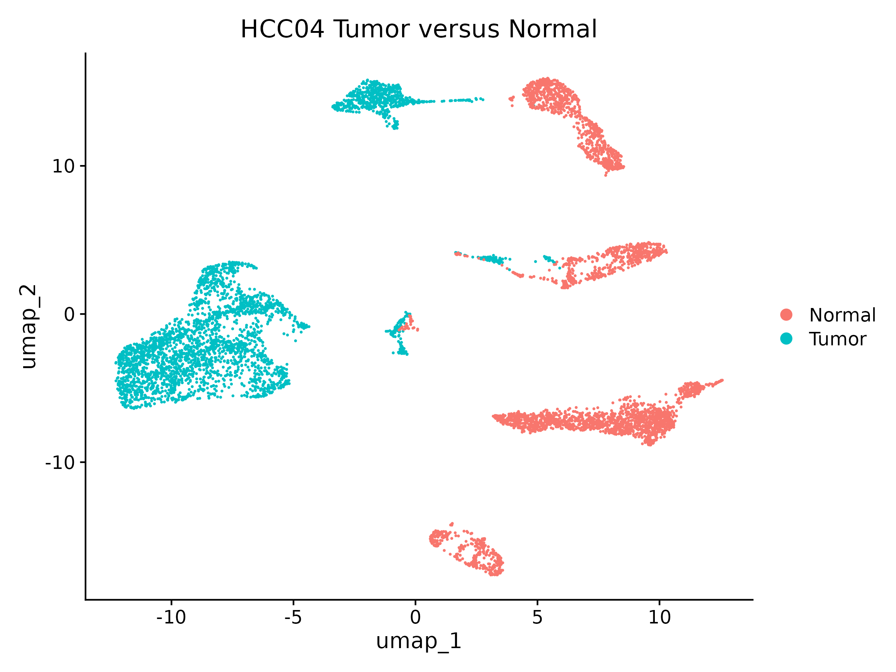
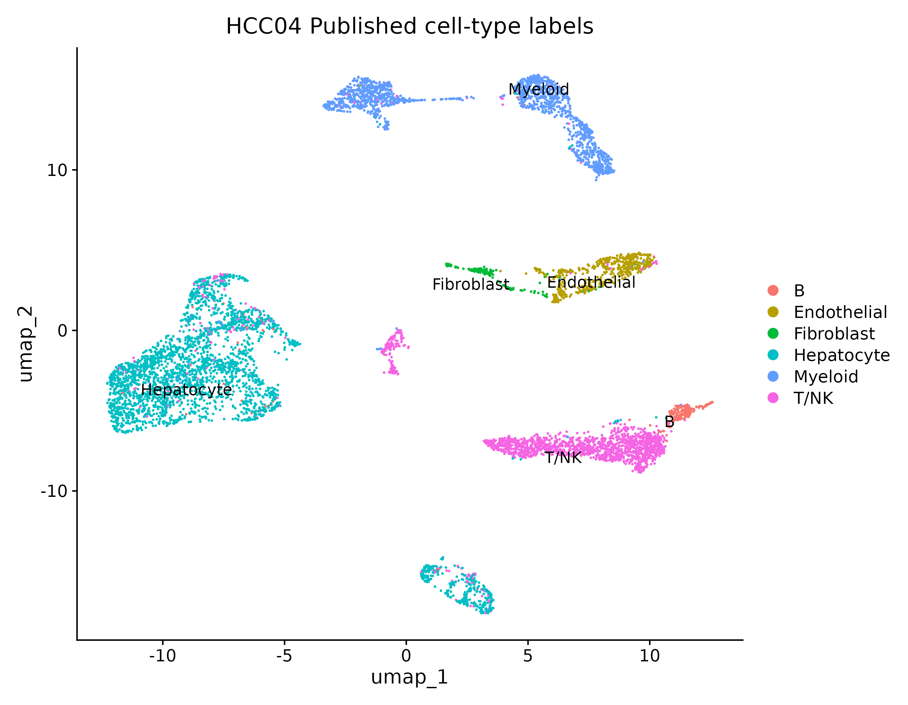
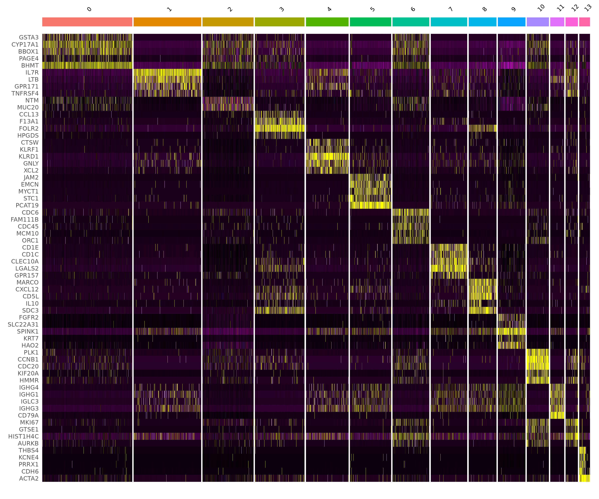
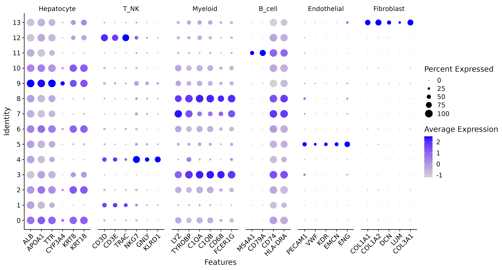
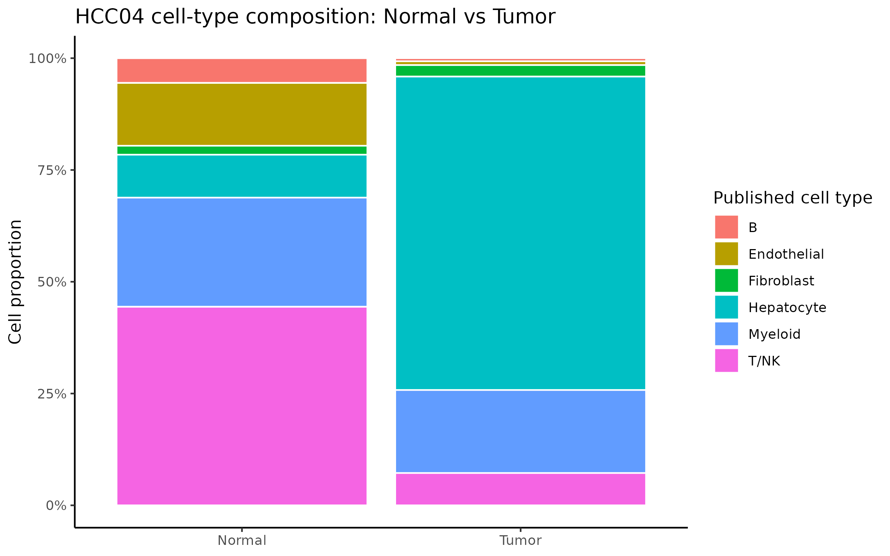
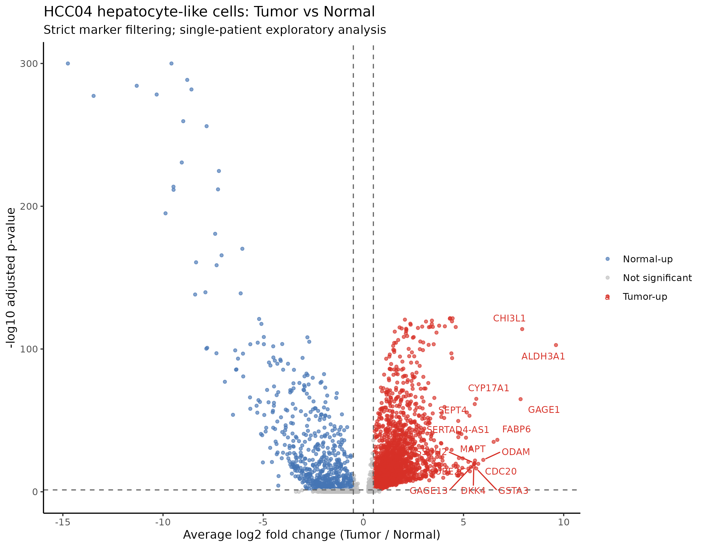
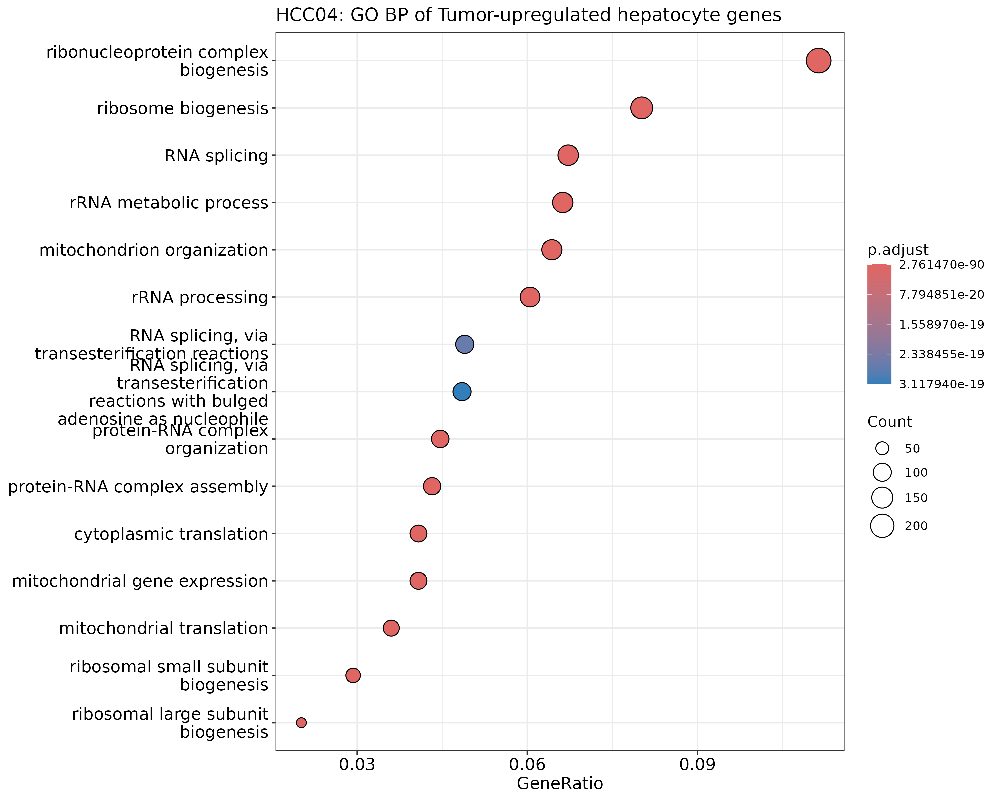

# Hepatocellular Carcinoma (HCC) — Single-Cell RNA-seq Tumor vs Normal Analysis

[](https://www.r-project.org/)
[](https://satijalab.org/seurat/)
[](https://bioconductor.org/packages/clusterProfiler/)
[](https://www.ncbi.nlm.nih.gov/geo/query/acc.cgi?acc=GSE149614)
[](https://opensource.org/licenses/MIT)

## Project Overview

This repository contains a single-cell RNA-seq analysis of matched tumor and non-tumor liver samples from patient **HCC04** in GEO accession **GSE149614**. The source study used 10x Genomics Chromium Single Cell 3' sequencing to profile the multicellular ecosystem of hepatocellular carcinoma (HCC).

The analysis was performed in Galaxy Europe RStudio using a memory-conscious workflow designed for a large processed count matrix. Metadata were loaded first, and only HCC04 matched Normal and Tumor cells were selected from the full count matrix. The workflow includes quality control, normalization, variable-feature selection, PCA, graph-based clustering, UMAP, cluster-marker discovery, validation against GEO-provided cell-type annotations, cell-composition analysis, strict hepatocyte-like cell filtering, tumor-vs-normal differential expression, and Gene Ontology Biological Process enrichment.

**Main Analysis Script:** [`scripts/single_cell.R`](scripts/single_cell.R)

---

## Dataset Analyzed

| Field | Details |
|---|---|
| GEO accession | [GSE149614](https://www.ncbi.nlm.nih.gov/geo/query/acc.cgi?acc=GSE149614) |
| Study title | A Single-Cell Atlas of the Multicellular Ecosystem of Primary and Metastatic Hepatocellular Carcinoma |
| Organism | *Homo sapiens* |
| Technology | 10x Genomics Chromium Single Cell 3' v2 |
| Sequencing platform | Illumina NovaSeq 6000 |
| Reference genome | hg38 |
| Patient analysed | HCC04 |
| Comparison | Matched non-tumor liver vs primary HCC tumor |
| Initial HCC04 cells | 6,897 cells |
| Normal cells | 3,396 |
| Tumor cells | 3,501 |
| Source cell labels | B, Endothelial, Fibroblast, Hepatocyte, Myeloid, T/NK |

The parent study profiled more than 70,000 cells from 10 patients across primary tumor, non-tumor liver, portal vein tumor thrombus, and metastatic lymph-node tissues. This repository focuses on one matched patient as a reproducible and computationally manageable pilot analysis.

- **Condition labels:** `Normal` = non-tumor liver | `Tumor` = primary HCC tumor
- **Selected patient:** `HCC04`
- **Published metadata:** [`metadata/GSE149614_HCC.metadata.updated.txt`](metadata/GSE149614_HCC.metadata.updated.txt)
- **Processed count matrix:** available from the [GSE149614 GEO record](https://www.ncbi.nlm.nih.gov/geo/query/acc.cgi?acc=GSE149614)

---

## Analytical Pipeline

### 1. Metadata-First Cell Selection

The processed count matrix contains 71,915 cells and is approximately 3.5 GB when decompressed. To avoid loading the full matrix into memory:

1. The small GEO cell metadata file was loaded first.
2. Cells belonging to HCC04 were selected.
3. Only `Normal` and `Tumor` HCC04 cells were retained.
4. `data.table::fread(select = ...)` was used to import only the selected 6,897 cell columns.
5. The selected matrix was converted to a sparse `dgCMatrix` before creating the Seurat object.

### 2. Seurat Object and Metadata Integration

A Seurat object was created using `CreateSeuratObject()` with:

- `min.cells = 3`
- `min.features = 200`

Published GEO metadata were attached using `AddMetaData()`, including:

- Sample ID
- Tissue site
- Patient ID
- Disease stage
- Viral status
- Published broad cell-type annotation

### 3. Quality Control

QC metrics were calculated using:

- `nFeature_RNA`: number of detected genes per cell
- `nCount_RNA`: total UMI counts per cell
- `percent.mt`: percentage of mitochondrial transcripts
- `percent.ribo`: percentage of ribosomal transcripts

Initial QC summary for HCC04:

| Metric | Value |
|---|---:|
| Median detected genes per cell | 1,895 |
| Median UMI counts per cell | 6,479 |
| Median mitochondrial percentage | 3.59% |
| Maximum mitochondrial percentage | 19.98% |

Cells were filtered using conservative thresholds:

- `nFeature_RNA >= 500`
- `nFeature_RNA <= 6500`
- `nCount_RNA <= 50000`
- `percent.mt < 15`

### 4. Normalization, PCA and Clustering

The Seurat workflow included:

1. `NormalizeData()` using LogNormalize and scale factor 10,000
2. `FindVariableFeatures()` with 2,000 variable genes
3. `ScaleData()` with `percent.mt` regressed out
4. `RunPCA()` with 30 PCs calculated
5. `FindNeighbors()` using PCs 1–15
6. `FindClusters()` using Louvain clustering at resolution 0.5
7. `RunUMAP()` using PCs 1–15

This analysis identified **14 Seurat clusters**.

### 5. Cluster Markers and Source-Label Validation

Cluster markers were identified using `FindAllMarkers()` with:

- Positive markers only
- `min.pct = 0.25`
- `logfc.threshold = 0.25`

Unsupervised Seurat clusters were then compared against the GEO-provided broad cell-type labels. The analysis recovered hepatocyte, T/NK, myeloid, endothelial, B-cell, and fibroblast populations with strong agreement to the published annotations.

| Seurat clusters | Dominant published cell type |
|---|---|
| 0, 2, 6, 9, 10 | Hepatocyte |
| 1, 4, 12 | T/NK |
| 3, 7, 8 | Myeloid |
| 5 | Endothelial |
| 11 | B |
| 13 | Fibroblast |

### 6. Normal vs Tumor Cell Composition

Cell-type composition was calculated independently for Normal and Tumor samples using the GEO-provided annotations.

| Cell type | Normal cells | Tumor cells |
|---|---:|---:|
| B | 188 | 24 |
| Endothelial | 477 | 30 |
| Fibroblast | 68 | 90 |
| Hepatocyte | 326 | 2,454 |
| Myeloid | 829 | 650 |
| T/NK | 1,508 | 253 |

This is a descriptive comparison from one patient and is not a cohort-level differential-abundance test.

### 7. Strict Hepatocyte-Like Cell Filtering

Differential expression was restricted to a strict hepatocyte-like subset to reduce broad-annotation ambiguity and immune/B-cell signal.

```r
celltype == "Hepatocyte" &
ALB > 0 &
APOA1 > 0 &
PTPRC == 0 &
MS4A1 == 0 &
CD79A == 0
```

This retained:

| Group | Number of strict hepatocyte-like cells |
|---|---:|
| Normal | 211 |
| Tumor | 2,078 |
| Total | 2,289 |

### 8. Differential Expression Analysis

Tumor vs Normal differential expression was performed with Seurat `FindMarkers()` using the Wilcoxon rank-sum test.

```r
FindMarkers(
  hepatocyte_strict,
  ident.1 = "Tumor",
  ident.2 = "Normal",
  test.use = "wilcox",
  min.pct = 0.25,
  logfc.threshold = 0.25
)
```

- **Tumor-upregulated genes:** `adjusted p-value < 0.05` and `avg_log2FC >= 0.5`
- **Normal-upregulated genes:** `adjusted p-value < 0.05` and `avg_log2FC <= -0.5`
- Positive `avg_log2FC` values represent higher expression in Tumor because `Tumor` was used as `ident.1`.

Prominent HCC04 tumor-upregulated hepatocyte-like genes included:

| Gene | Broad biological relevance |
|---|---|
| `ALDH3A1` | Aldehyde metabolism and oxidative stress response |
| `CHI3L1` | Tumor-associated extracellular/inflammatory program |
| `CYP17A1` | Steroid-related metabolism |
| `GSTA3` | Glutathione metabolism and detoxification |
| `CDC20`, `UBE2C`, `CENPM` | Cell-cycle and proliferative programs |
| `GAGE1`, `GAGE13`, `GAGE2A` | Cancer-testis antigen family |
| `DKK4`, `IL17RB`, `TFF2` | Signalling and differentiation-associated genes |

### 9. GO Biological Process Enrichment

Gene Ontology Biological Process enrichment was performed for strict tumor-upregulated genes using:

```r
clusterProfiler::enrichGO(
  gene = tumor_up_strict$gene,
  OrgDb = org.Hs.eg.db,
  keyType = "SYMBOL",
  ont = "BP",
  pAdjustMethod = "BH",
  pvalueCutoff = 0.05,
  qvalueCutoff = 0.20
)
```

The tumor-upregulated gene set produced **518 significantly enriched GO Biological Process terms**.

Top enriched programs included:

- Ribonucleoprotein complex biogenesis
- Ribosome biogenesis
- rRNA processing
- rRNA metabolic process
- Cytoplasmic translation
- Mitochondrial translation
- Mitochondrial gene expression
- RNA splicing
- Mitochondrion organization

---

## Visualizations

### 1. Seurat Clusters, Tumor vs Normal, and Published Cell Types

<p align="center">
  
  
  
</p>

---

### 2. Cluster Marker Heatmap and Canonical Marker Dot Plot

<p align="center">
  
  
</p>

---

### 3. Cell-Type Composition: Normal vs Tumor

<p align="center">
  
</p>

---

### 4. Strict Hepatocyte-Like Tumor vs Normal Differential Expression

The volcano plot shows strict hepatocyte-like tumor-vs-normal differential expression. Tumor-upregulated genes are shown in red, Normal-upregulated genes in blue, and non-significant genes in grey.

<p align="center">
  
</p>

---

### 5. GO Biological Process Enrichment of Tumor-Upregulated Genes

<p align="center">
  
</p>

---

## Repository Structure

```text
HCC04-scRNAseq-tumor-normal-analysis/
├── metadata/
│   └── GSE149614_HCC.metadata.updated.txt
├── scripts/
│   └── single_cell.R
├── figures/
│   ├── clustering/
│   ├── composition/
│   ├── differential_expression/
│   ├── markers/
│   └── pathway_enrichment/
├── tables/
│   ├── differential_expression/
│   ├── markers/
│   └── pathway_enrichment/
├── data/                 # Not uploaded: original count matrix is ~3.5 GB
└── objects/              # Not uploaded: large Seurat RDS objects
```

---

## R Dependencies

### CRAN

| Package | Role |
|---|---|
| `data.table` | Memory-efficient selective import of the large count matrix |
| `Matrix` | Sparse count-matrix representation |
| `dplyr` | Data wrangling |
| `ggplot2` | Data visualization |
| `ggrepel` | Non-overlapping volcano-plot gene labels |

### Bioconductor and Single-Cell Packages

| Package | Role |
|---|---|
| `Seurat` | QC, normalization, PCA, clustering, UMAP, marker detection, and DE |
| `clusterProfiler` | GO Biological Process over-representation analysis |
| `org.Hs.eg.db` | Human gene-symbol annotation database |
| `enrichplot` | Enrichment-result visualization |

### Installation

```r
# CRAN
install.packages(c(
  "data.table",
  "Matrix",
  "dplyr",
  "ggplot2",
  "ggrepel"
))

# Bioconductor
if (!requireNamespace("BiocManager", quietly = TRUE)) {
  install.packages("BiocManager")
}

BiocManager::install(c(
  "Seurat",
  "clusterProfiler",
  "org.Hs.eg.db",
  "enrichplot"
))
```

---

## Reproducibility Notes

- The full processed count matrix is not stored in this repository because the decompressed file is approximately 3.5 GB.
- Download the processed matrix and source metadata directly from [GSE149614](https://www.ncbi.nlm.nih.gov/geo/query/acc.cgi?acc=GSE149614).
- The analysis script, metadata, figures, and output tables are included.
- The workflow was run in Galaxy Europe RStudio.
- The large input count matrix was imported selectively using `data.table::fread(select = ...)`.
- Seurat objects are excluded from GitHub because they are large; they can be recreated using the provided analysis script and GEO processed data.

---

## Limitations

- This is an exploratory analysis of a single matched patient, HCC04.
- The strict hepatocyte-like groups are unbalanced: 2,078 Tumor cells and 211 Normal cells.
- Cell-level Wilcoxon testing treats cells as observations and does not replace patient-level pseudobulk differential-expression analysis.
- GEO-provided labels are broad and residual ambient RNA or doublets may affect single-cell differential-expression findings.
- The results should be interpreted as HCC04-specific tumor-associated transcriptional patterns, not as universal HCC biomarkers.
- Future work should use multi-patient pseudobulk analysis, differential-abundance testing, malignant-cell inference, and validation in independent cohorts.

---

## Citation

If you use this dataset, cite the original publication:

> Lu Y, Yang A, Quan C, Pan Y, et al. A single-cell atlas of the multicellular ecosystem of primary and metastatic hepatocellular carcinoma. *Nature Communications*. 2022;13:4594. PMID: [35933472](https://pubmed.ncbi.nlm.nih.gov/35933472/).

